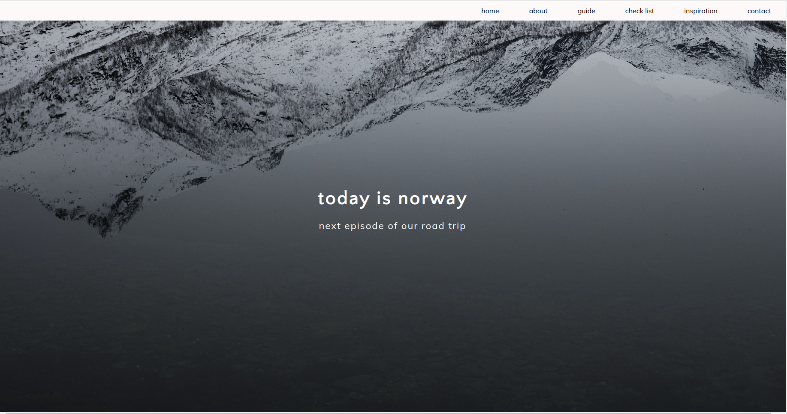
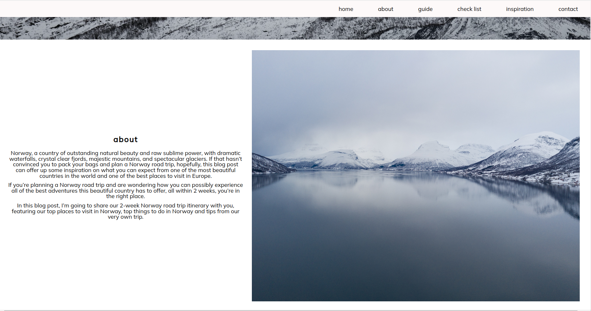
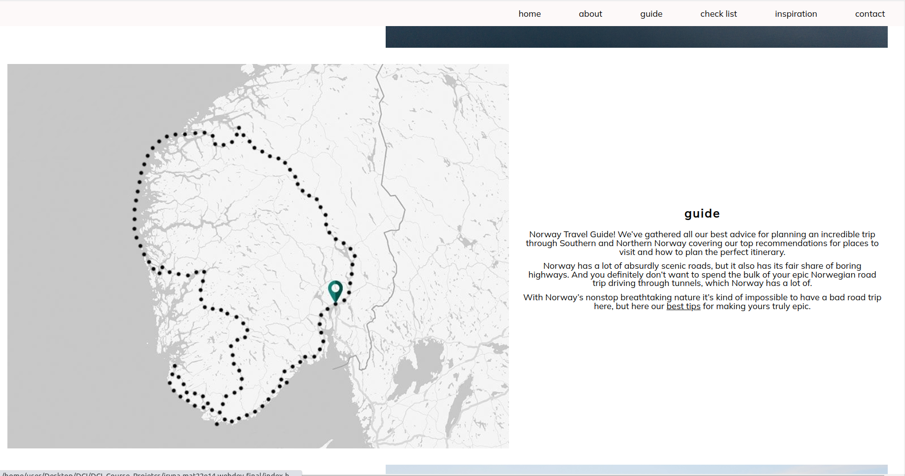
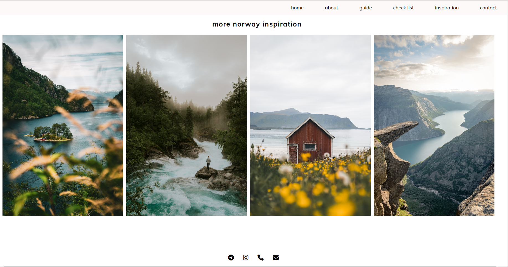

# myNorway

myNorway marks my initial foray into web development through the DCI Further Training program as a Web & Software Developer.

This personal blog stems from my inspiring journey to Norway, driving the inception of this project.

To craft this webpage, I used HTML and CSS for the development.

